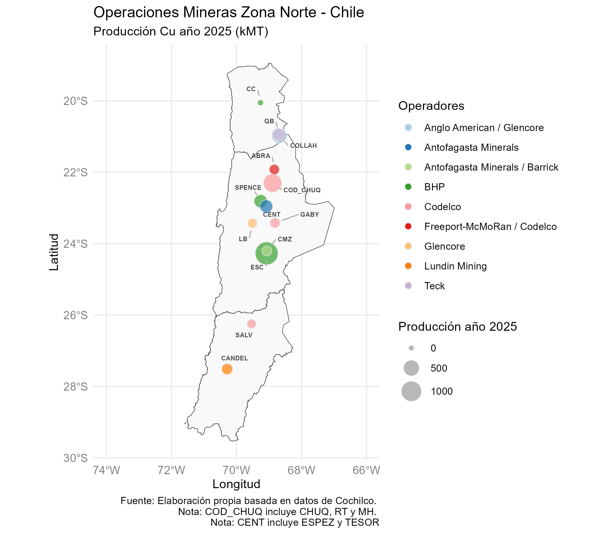

# Visualización de Producción Minera en el Norte de Chile

Este proyecto utiliza **R** y librerías espaciales (`sf`, `chilemapas`) para visualizar la ubicación geográfica y la producción proyectada de los principales yacimientos de cobre en las regiones I, II y III de Chile.

## 💡 Características
- **Cruce de datos:** Une datos de producción de Cochilco con coordenadas geográficas.
- **Centroides:** Unifica distritos complejos (como Codelco Norte y Centinela) en puntos centrales para una visualización limpia.
- **Mapas Proporcionales:** Representa la producción 2025 mediante el tamaño de las burbujas.
- **Estética Profesional:** Uso de `ggrepel` para evitar solapamiento de nombres y paletas de colores neutrales.

## 🛠️ Requisitos
Es necesario tener instaladas las siguientes librerías en R:

```r
install.packages(c("tidyverse", "chilemapas", "readxl", "sf", "RColorBrewer", "ggrepel"))
```



## 📚 Bibliografía y Fuentes

- Comisión Chilena del Cobre (Cochilco), sección Estadistícas > Base de Datos Electrónica (BDE) https://www.cochilco.cl
- Pebesma, E. Bivand, R. Spatial Data Science with Applications in R https://r-spatial.org/book/
